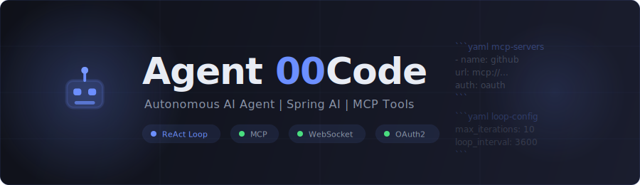

<p align="center">
  
</p>

<p align="center">
  <a href="https://openjdk.org/projects/jdk/21/"></a>
  <a href="https://spring.io/projects/spring-boot"></a>
  <a href="https://docs.spring.io/spring-ai/reference/"></a>
</p>

An autonomous AI agent that monitors GitHub PRs, reviews code, and takes action -- all defined in a single `AGENTS.md` file. Powered by Spring Boot, Spring AI, and the Model Context Protocol (MCP).

**Define your agent's persona, connect it to tools, set a schedule, and let it work.**

## Table of Contents

- [Quick Start](#quick-start)
- [How It Works](#how-it-works)
- [Configuring Your Agent](#configuring-your-agent)
- [Web UI](#web-ui)
- [Deploying to Cloud Foundry](#deploying-to-cloud-foundry)
- [Architecture](#architecture)
- [Testing](#testing)
- [License](#license)

## Quick Start

```bash
git clone https://github.com/your-org/agent-00code.git
cd agent-00code
```

Set your LLM credentials:

```bash
export LLM_BASE_URL=https://api.openai.com/v1
export LLM_API_KEY=sk-your-key-here
export LLM_MODEL=gpt-4o
```

Build and run:

```bash
./mvnw spring-boot:run
```

Open [http://localhost:8080](http://localhost:8080) -- you'll see the chat UI. The agent is ready to talk and will begin its scheduled loop if one is configured in `AGENTS.md`.

## How It Works

Agent 00Code implements a **ReAct-style agentic loop** (think, act, observe, repeat):

1. The agent reads its persona and instructions from `AGENTS.md`
2. It connects to MCP servers declared in the same file (GitHub, Jira, databases, etc.)
3. On each iteration, it reasons about the task, calls tools, observes results, and decides the next step
4. It can run interactively via the web UI or autonomously on a configurable schedule

### Key capabilities

- **MCP tool integration** -- connect to any Model Context Protocol server
- **AGENTS.md-driven config** -- system prompt, tools, skills, and schedule in one Markdown file
- **Real-time web UI** -- chat with the agent and watch scheduled runs live via WebSocket
- **OAuth2 authentication** -- built-in OAuth2 flow for MCP servers that require authorization
- **Scheduled autonomous runs** -- execute tasks on a recurring interval without user input
- **OpenAI-compatible** -- works with any OpenAI-compatible LLM endpoint (OpenAI, Azure, local models)
- **Cloud Foundry ready** -- one-command deployment with web and worker processes

## Configuring Your Agent

All agent behavior is defined in `AGENTS.md`. The file contains:

1. **Free-form Markdown** -- becomes the agent's system prompt
2. **`yaml mcp-servers` block** -- declares MCP server connections with optional OAuth
3. **`yaml skills` block** -- registers reusable skill prompts
4. **`yaml loop-config` block** -- sets autonomous loop behavior

### Example AGENTS.md

````markdown
You are a helpful engineering assistant that reviews pull requests.

## MCP Servers

```yaml mcp-servers
- name: github
  url: https://mcp-gateway.example.com/github/mcp
  auth: oauth
  scopes:
    - repo
    - read:user
```

## Loop Config

```yaml loop-config
max_iterations: 10
initial_prompt: Check for open PRs and review them.
loop_interval_seconds: 3600
```
````

### Environment Variables

| Variable | Default | Description |
|----------|---------|-------------|
| `LLM_BASE_URL` | `https://api.openai.com/v1` | OpenAI-compatible API base URL |
| `LLM_API_KEY` | *(required)* | API key for the LLM provider |
| `LLM_MODEL` | `gpt-4o` | Model identifier |
| `AGENTS_MD_PATH` | `./AGENTS.md` | Path to the agent definition file |
| `PORT` | `8080` | Server port |

## Web UI

The single-page web interface provides three areas:

- **Chat tab** -- interactive conversation with the agent, showing thoughts, tool calls, and results streamed in real time
- **Live Runs tab** -- observe scheduled background runs with a badge counter for unread events
- **Tools sidebar** -- browse all available MCP tools with their JSON schemas; authorize OAuth-protected servers with one click

## Deploying to Cloud Foundry

```bash
./mvnw clean package -DskipTests
cf push
```

The included `manifest.yml` configures:

- **`web` process** -- serves the UI, REST endpoints, and WebSocket connections
- **`worker` process** -- runs the scheduled agent loop headlessly (no web server, no route)

Set LLM credentials as CF environment variables or bind a GenAI service instance (auto-detected via `java-cfenv`).

## Architecture

```
com.agent00code
├── config/          # AGENTS.md parser, Spring auto-configurations, MCP client setup
├── loop/            # ReAct agentic loop, scheduled runner, event model
├── web/             # WebSocket handlers (chat + agent), REST endpoints, security
└── cloud/           # Cloud Foundry GenAI service binding support
```

### Data flow

```
                   AGENTS.md
                      │
              AgentConfigParser
                      │
                  AgentConfig
                 /          \
   ChatWebSocketHandler    ScheduledLoopRunner
         │                        │
     AgentLoop ◄──── ChatClient + MCP ToolCallbacks
         │
     LoopEvents ──► WebSocket ──► Browser UI
```

### Prerequisites

- Java 21+
- Maven 3.9+ (or use the included `mvnw` wrapper)
- An OpenAI-compatible API key

## Testing

```bash
./mvnw test
```

Tests cover configuration parsing, the agent loop, web controllers, and Cloud Foundry environment auto-configuration.

## License

See [LICENSE](LICENSE) for details.
